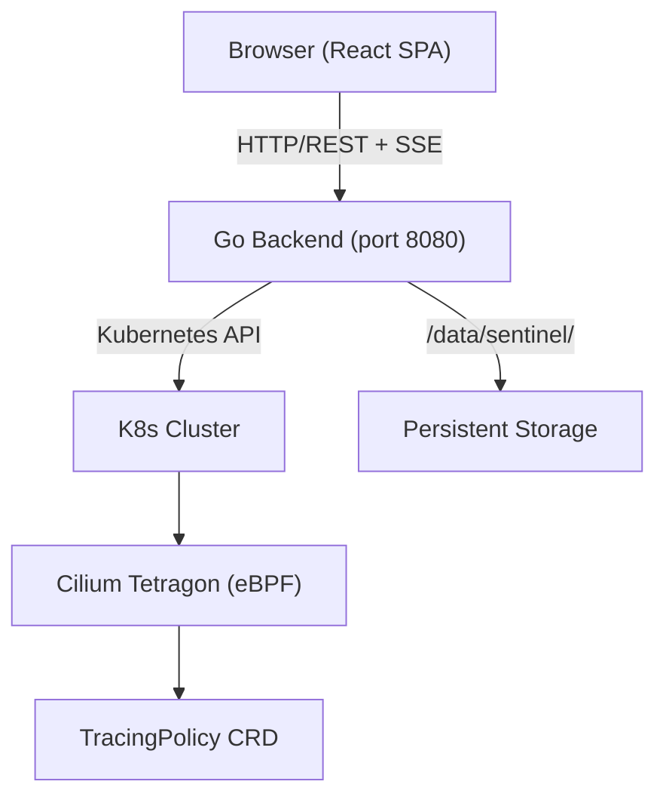
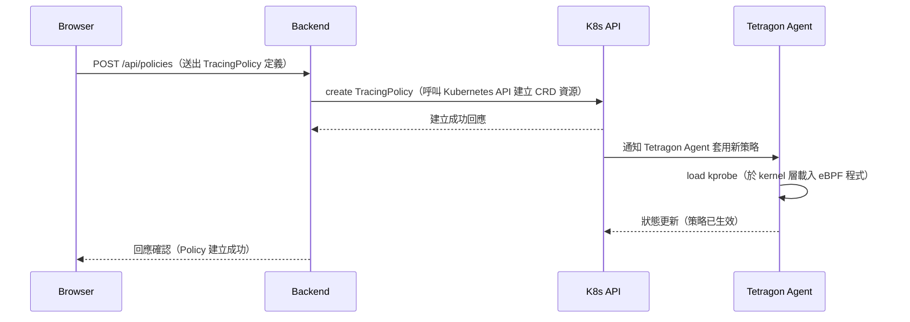

# 架構說明

## 系統架構圖

下圖說明 Sentinel 各元件之間的部署關係與通訊路徑：

## 元件說明

| 元件 | 技術 | 說明 |
|---|---|---|
| Frontend | TypeScript + React + Vite + shadcn/ui | 網頁操作介面，以 SPA 形式提供 TracingPolicy 管理、事件檢視與叢集監控等功能 |
| Backend | Go 1.x + HTTP Server (port 8080) | 提供 RESTful API 服務，內建 Kubernetes 客戶端，負責與叢集溝通並處理使用者驗證 |
| Cilium Tetragon | eBPF DaemonSet | 部署於每個 Kubernetes Node 的安全觀測代理程式，透過 eBPF 技術於 kernel 層捕捉系統呼叫與網路事件 |
| TracingPolicy | Kubernetes CRD (cilium.io/v1alpha1) | 定義 Tetragon 所要追蹤的 kprobe 規則與安全策略的自訂資源定義 |
| Persistent Storage | /data/sentinel/ | 儲存使用者帳號資料（users.json）與 JWT 簽署金鑰（.jwt-secret）的本機持久化路徑 |

## 資料流說明

以下循序圖說明使用者透過 Sentinel 建立一條新 TracingPolicy 的完整流程：

## 部署架構

Sentinel 採用**單一 binary 部署**模式，大幅簡化安裝流程：

Go backend 在編譯時透過 `embed.go` 將前端 React SPA 的靜態檔案（HTML、JavaScript、CSS）完整內嵌至 binary 中。部署時只需複製並執行單一可執行檔，無需額外的 Web 伺服器或靜態檔案服務。

持久化資料存放於以下路徑：

| 路徑 | 用途 |
|---|---|
| `/data/sentinel/users.json` | 儲存使用者帳號與密碼雜湊 |
| `/data/sentinel/.jwt-secret` | 儲存 JWT Token 簽署金鑰，首次啟動時自動產生 |
