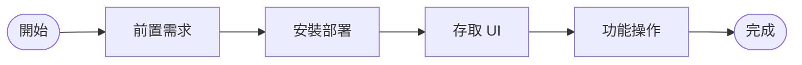

# 專案簡介

## Sentinel 是什麼

Sentinel 是一套針對 Kubernetes 叢集內 Cilium Tetragon TracingPolicy 所設計的圖形化管理介面，讓 DevSecOps 工程師與 Platform 團隊能夠透過直覺化的網頁操作介面，完整管理安全監控策略的生命週期，徹底免去繁瑣的手動 kubectl 操作，大幅降低策略部署與維護的門檻。

## 核心功能一覽

| 功能模組 | 說明 |
|---|---|
| TracingPolicy 管理 | 以視覺化方式建立、編輯、啟用、停用及刪除 TracingPolicy，無需手動撰寫 YAML |
| Behavior Discovery | 自動分析叢集內的工作負載行為，協助工程師探索潛在的安全基準線 |
| Security Events | 即時呈現 Tetragon 捕捉到的 kprobe 安全事件，支援篩選與追蹤 |
| Cluster 資訊 | 總覽 Kubernetes 叢集節點、命名空間與 Tetragon Agent 狀態 |
| User 管理 | 提供使用者帳號建立、角色指派與 JWT 驗證管理功能 |

## 適用對象

- **DevSecOps 工程師**：需要在 Kubernetes 環境中快速制定與調整 eBPF 安全策略，並持續監控安全事件的人員
- **Platform 團隊**：負責維運 Kubernetes 叢集、管理 Cilium 網路策略，並確保 Tetragon 安全觀測能力正常運作的工程師
- **需在 K8s 落地 Tetragon 策略的人員**：希望將 Tetragon TracingPolicy 導入生產環境，但不熟悉 CRD 操作或希望提升策略管理效率的技術人員

## 閱讀指引

建議依照以下順序閱讀本份文件，以最快速地完成 Sentinel 的部署與上手：

