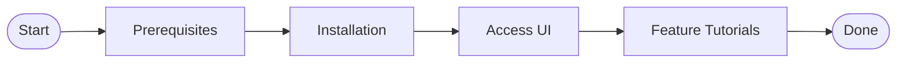
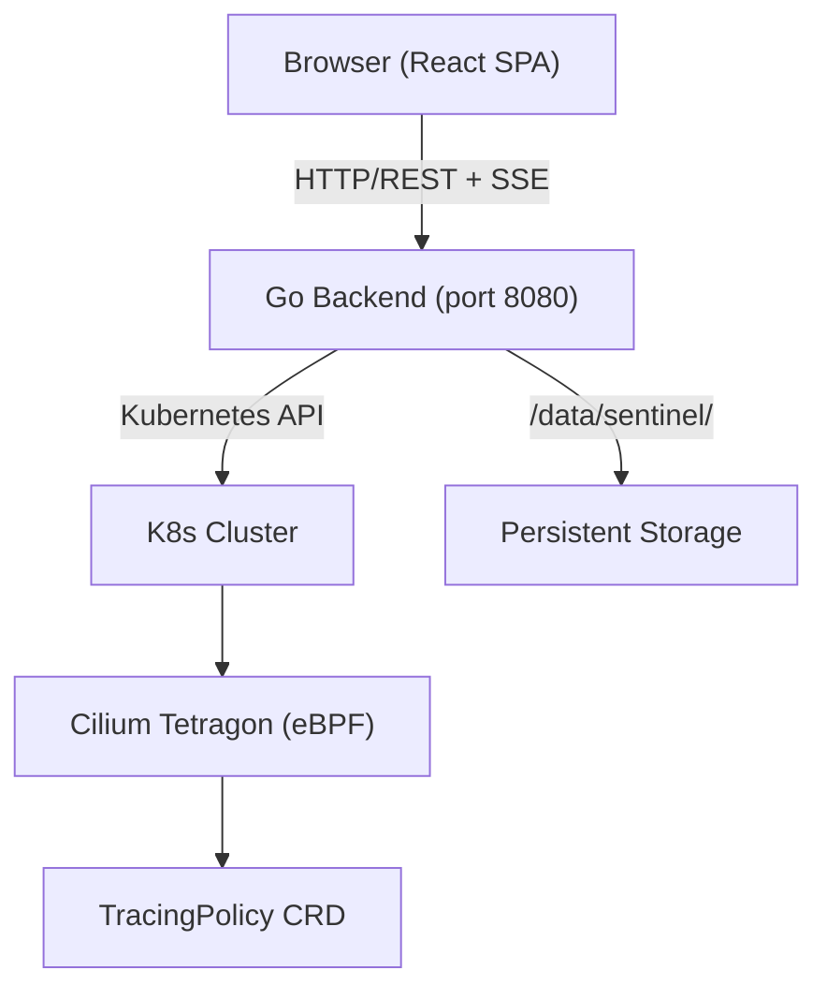
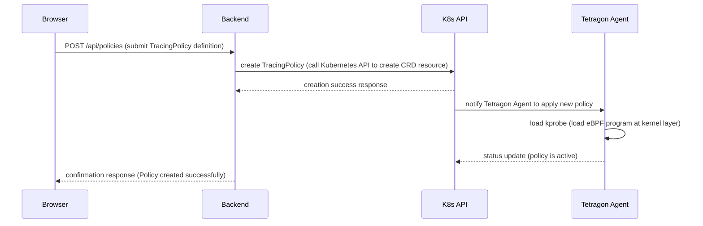
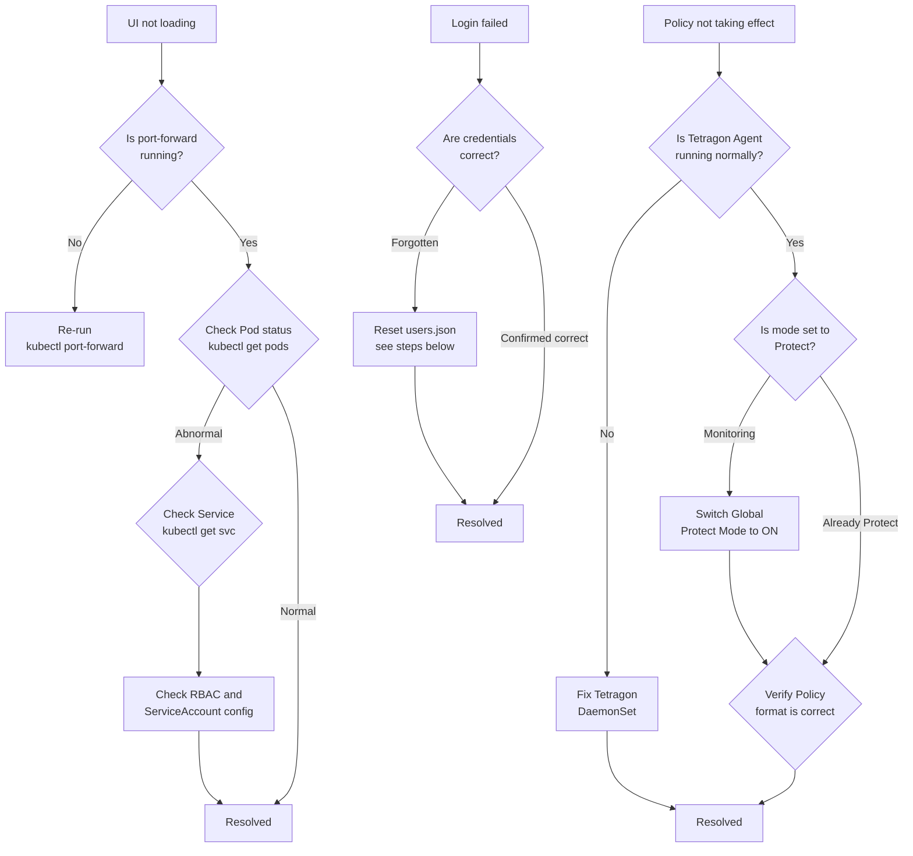

# Logo Replacement + i18n Implementation Plan

> **For agentic workers:** REQUIRED SUB-SKILL: Use superpowers:subagent-driven-development (recommended) or superpowers:executing-plans to implement this plan task-by-task. Steps use checkbox (`- [ ]`) syntax for tracking.

**Goal:** Replace the Docusaurus navbar dinosaur logo with the Sentinel brand lockup SVG, and add Traditional Chinese / English language switching via Docusaurus i18n.

**Architecture:** Two transparent-background SVG variants (light/dark mode) replace the existing logo. The `i18n/en/` directory tree holds English translations of all 18 docs plus JSON files for navbar/footer/sidebar labels. Docusaurus's built-in `localeDropdown` navbar item handles the language switcher.

**Tech Stack:** Docusaurus 3.x, TypeScript config, SVG, Docusaurus i18n plugin (built-in)

---

## File Map

### Created
- `static/img/sentinel-lockup.svg` — Light mode navbar logo (dark elements, transparent background)
- `static/img/sentinel-lockup-dark.svg` — Dark mode navbar logo (white elements, transparent background)
- `i18n/en/docusaurus-theme-classic/navbar.json`
- `i18n/en/docusaurus-theme-classic/footer.json`
- `i18n/en/docusaurus-plugin-content-docs/current.json`
- `i18n/en/docusaurus-plugin-content-docs/current/intro.md`
- `i18n/en/docusaurus-plugin-content-docs/current/architecture.md`
- `i18n/en/docusaurus-plugin-content-docs/current/prerequisites.md`
- `i18n/en/docusaurus-plugin-content-docs/current/installation/index.md`
- `i18n/en/docusaurus-plugin-content-docs/current/installation/job-install.md`
- `i18n/en/docusaurus-plugin-content-docs/current/installation/script-install.md`
- `i18n/en/docusaurus-plugin-content-docs/current/access/port-forward.md`
- `i18n/en/docusaurus-plugin-content-docs/current/access/ingress.md`
- `i18n/en/docusaurus-plugin-content-docs/current/features/dashboard.md`
- `i18n/en/docusaurus-plugin-content-docs/current/features/tracing-policy.md`
- `i18n/en/docusaurus-plugin-content-docs/current/features/form-editor.md`
- `i18n/en/docusaurus-plugin-content-docs/current/features/yaml-editor.md`
- `i18n/en/docusaurus-plugin-content-docs/current/features/execution-mode.md`
- `i18n/en/docusaurus-plugin-content-docs/current/features/behavior-discovery.md`
- `i18n/en/docusaurus-plugin-content-docs/current/features/notifications.md`
- `i18n/en/docusaurus-plugin-content-docs/current/features/namespace-view.md`
- `i18n/en/docusaurus-plugin-content-docs/current/uninstall.md`
- `i18n/en/docusaurus-plugin-content-docs/current/troubleshooting.md`

### Modified
- `docusaurus.config.ts` — logo src/srcDark, navbar title cleared, i18n locales + localeConfigs, localeDropdown item

---

## Task 1: Create Light-Mode Lockup SVG

**Files:**
- Create: `static/img/sentinel-lockup.svg`

Derived from `~/sentinel-lockup-light.svg` — remove the white `<rect>` background, keep all dark elements (`#0B0F19`) for rendering on a white/light navbar.

- [ ] **Step 1: Write the file**

```xml
<svg width="240" height="64" viewBox="0 0 360 96" fill="none" xmlns="http://www.w3.org/2000/svg" role="img" aria-label="Sentinel">
  <g transform="translate(8,8) scale(0.8)">
    <path d="M50 7 L85 21 V51 C85 71 69 85 50 93 C31 85 15 71 15 51 V21 Z" fill="#0B0F19"/>
    <path d="M50 16 L77 27 V51 C77 66 65 77 50 84 C35 77 23 66 23 51 V27 Z" fill="#FFFFFF"/>
    <path d="M31 50 Q50 35 69 50 Q50 65 31 50 Z" fill="none" stroke="#0B0F19" stroke-width="4" stroke-linejoin="round"/>
    <circle cx="50" cy="50" r="7.5" fill="#0B0F19"/>
    <circle cx="50" cy="50" r="2.6" fill="#FFFFFF"/>
  </g>
  <text x="96" y="52" font-family="-apple-system,Segoe UI,Roboto,sans-serif" font-size="38" font-weight="600" fill="#0B0F19">Sentinel</text>
  <text x="97" y="74" font-family="-apple-system,Segoe UI,Roboto,sans-serif" font-size="11" letter-spacing="3" fill="#475569">TRACING POLICY CONSOLE</text>
</svg>
```

Save to `static/img/sentinel-lockup.svg`.

- [ ] **Step 2: Verify file exists**

```bash
ls -la /home/bigred/Sentinel-doc/static/img/sentinel-lockup.svg
```

Expected: file present, ~700 bytes.

---

## Task 2: Create Dark-Mode Lockup SVG

**Files:**
- Create: `static/img/sentinel-lockup-dark.svg`

Same structure but all elements inverted for a dark navbar (`#1b1b1d`): shield outer fill → `#FFFFFF`, inner fill → `#1b1b1d`, text → `#FFFFFF`, subtitle → `#aaaaaa`.

- [ ] **Step 1: Write the file**

```xml
<svg width="240" height="64" viewBox="0 0 360 96" fill="none" xmlns="http://www.w3.org/2000/svg" role="img" aria-label="Sentinel">
  <g transform="translate(8,8) scale(0.8)">
    <path d="M50 7 L85 21 V51 C85 71 69 85 50 93 C31 85 15 71 15 51 V21 Z" fill="#FFFFFF"/>
    <path d="M50 16 L77 27 V51 C77 66 65 77 50 84 C35 77 23 66 23 51 V27 Z" fill="#1b1b1d"/>
    <path d="M31 50 Q50 35 69 50 Q50 65 31 50 Z" fill="none" stroke="#FFFFFF" stroke-width="4" stroke-linejoin="round"/>
    <circle cx="50" cy="50" r="7.5" fill="#FFFFFF"/>
    <circle cx="50" cy="50" r="2.6" fill="#1b1b1d"/>
  </g>
  <text x="96" y="52" font-family="-apple-system,Segoe UI,Roboto,sans-serif" font-size="38" font-weight="600" fill="#FFFFFF">Sentinel</text>
  <text x="97" y="74" font-family="-apple-system,Segoe UI,Roboto,sans-serif" font-size="11" letter-spacing="3" fill="#aaaaaa">TRACING POLICY CONSOLE</text>
</svg>
```

Save to `static/img/sentinel-lockup-dark.svg`.

- [ ] **Step 2: Verify file exists**

```bash
ls -la /home/bigred/Sentinel-doc/static/img/sentinel-lockup-dark.svg
```

Expected: file present, ~700 bytes.

---

## Task 3: Update docusaurus.config.ts

**Files:**
- Modify: `docusaurus.config.ts`

Four changes:
1. `navbar.title` → `''`
2. `navbar.logo.src` → `'img/sentinel-lockup.svg'`, add `srcDark: 'img/sentinel-lockup-dark.svg'`
3. `i18n.locales` → `['zh-TW', 'en']`, add `localeConfigs`
4. Add `localeDropdown` item to `navbar.items`

- [ ] **Step 1: Apply all changes**

Replace the entire `i18n` block:

```typescript
i18n: {
  defaultLocale: 'zh-TW',
  locales: ['zh-TW', 'en'],
  localeConfigs: {
    'zh-TW': { label: '繁體中文' },
    en: { label: 'English' },
  },
},
```

Replace the `navbar` block inside `themeConfig`:

```typescript
navbar: {
  title: '',
  logo: {
    alt: 'Sentinel',
    src: 'img/sentinel-lockup.svg',
    srcDark: 'img/sentinel-lockup-dark.svg',
  },
  items: [
    {
      type: 'docSidebar',
      sidebarId: 'sentinelSidebar',
      position: 'left',
      label: '文件',
    },
    {
      type: 'localeDropdown',
      position: 'right',
    },
    {
      href: 'https://github.com/cooloo9871/Sentinel',
      label: 'GitHub',
      position: 'right',
    },
  ],
},
```

- [ ] **Step 2: Verify config parses (TypeScript check)**

```bash
cd /home/bigred/Sentinel-doc && npx tsc --noEmit --project tsconfig.json 2>&1 | head -20
```

Expected: no errors (or only pre-existing unrelated warnings).

---

## Task 4: Scaffold i18n JSON Files

**Files:**
- Create: `i18n/en/docusaurus-theme-classic/navbar.json`
- Create: `i18n/en/docusaurus-theme-classic/footer.json`
- Create: `i18n/en/docusaurus-plugin-content-docs/current.json`

Run the Docusaurus translation extractor to generate template JSON files, then fill in English values.

- [ ] **Step 1: Run write-translations**

```bash
cd /home/bigred/Sentinel-doc && npm run write-translations -- --locale en 2>&1
```

Expected: output mentions creating files under `i18n/en/`.

- [ ] **Step 2: Verify generated files exist**

```bash
ls /home/bigred/Sentinel-doc/i18n/en/docusaurus-theme-classic/
ls /home/bigred/Sentinel-doc/i18n/en/docusaurus-plugin-content-docs/
```

- [ ] **Step 3: Write navbar.json**

Write `i18n/en/docusaurus-theme-classic/navbar.json` with this content (merging any auto-generated keys with English translations):

```json
{
  "item.label.文件": {
    "message": "Docs",
    "description": "Navbar item with label 文件"
  },
  "item.label.GitHub": {
    "message": "GitHub",
    "description": "Navbar item with label GitHub"
  }
}
```

- [ ] **Step 4: Write footer.json**

Write `i18n/en/docusaurus-theme-classic/footer.json`:

```json
{
  "link.item.label.快速開始": {
    "message": "Quick Start",
    "description": "The label of footer link with label=快速開始"
  },
  "link.item.label.安裝與部署": {
    "message": "Installation",
    "description": "The label of footer link with label=安裝與部署"
  },
  "link.item.label.功能操作教學": {
    "message": "Feature Tutorials",
    "description": "The label of footer link with label=功能操作教學"
  },
  "link.item.label.GitHub": {
    "message": "GitHub",
    "description": "The label of footer link with label=GitHub"
  },
  "link.item.label.Cilium Tetragon": {
    "message": "Cilium Tetragon",
    "description": "The label of footer link with label=Cilium Tetragon"
  },
  "link.title.文件": {
    "message": "Documentation",
    "description": "The title of footer link group with title=文件"
  },
  "link.title.相關連結": {
    "message": "Links",
    "description": "The title of footer link group with title=相關連結"
  }
}
```

- [ ] **Step 5: Write current.json**

Write `i18n/en/docusaurus-plugin-content-docs/current.json`:

```json
{
  "sidebar.sentinelSidebar.category.開始使用": {
    "message": "Getting Started",
    "description": "The label for category 開始使用 in sidebar sentinelSidebar"
  },
  "sidebar.sentinelSidebar.category.安裝與部署": {
    "message": "Installation",
    "description": "The label for category 安裝與部署 in sidebar sentinelSidebar"
  },
  "sidebar.sentinelSidebar.category.存取 UI": {
    "message": "Accessing the UI",
    "description": "The label for category 存取 UI in sidebar sentinelSidebar"
  },
  "sidebar.sentinelSidebar.category.功能操作教學": {
    "message": "Feature Tutorials",
    "description": "The label for category 功能操作教學 in sidebar sentinelSidebar"
  }
}
```

---

## Task 5: Create i18n Directory Structure

**Files:**
- Create directories: `i18n/en/docusaurus-plugin-content-docs/current/installation/`, `access/`, `features/`

- [ ] **Step 1: Create subdirectories**

```bash
mkdir -p /home/bigred/Sentinel-doc/i18n/en/docusaurus-plugin-content-docs/current/installation
mkdir -p /home/bigred/Sentinel-doc/i18n/en/docusaurus-plugin-content-docs/current/access
mkdir -p /home/bigred/Sentinel-doc/i18n/en/docusaurus-plugin-content-docs/current/features
```

- [ ] **Step 2: Verify**

```bash
ls /home/bigred/Sentinel-doc/i18n/en/docusaurus-plugin-content-docs/current/
```

Expected: `installation/`, `access/`, `features/` directories present.

---

## Task 6: Translate docs/intro.md → English

**Files:**
- Create: `i18n/en/docusaurus-plugin-content-docs/current/intro.md`

- [ ] **Step 1: Write file**

```markdown
---
id: intro
title: Project Overview
sidebar_position: 1
slug: /
---

# Project Overview

## What is Sentinel

Sentinel is a graphical management console for Cilium Tetragon TracingPolicy within Kubernetes clusters. It enables DevSecOps engineers and Platform teams to manage the full lifecycle of security monitoring policies through an intuitive web interface — eliminating tedious manual `kubectl` operations and dramatically lowering the barrier to policy deployment and maintenance.

## Core Features

| Module | Description |
|---|---|
| TracingPolicy Management | Visually create, edit, enable, disable, and delete TracingPolicies — no manual YAML required |
| Behavior Discovery | Automatically analyze workload behavior in the cluster to help engineers discover security baselines |
| Security Events | Real-time display of kprobe security events captured by Tetragon, with filtering and tracking support |
| Cluster Info | Overview of Kubernetes cluster nodes, namespaces, and Tetragon Agent status |
| User Management | User account creation, role assignment, and JWT authentication management |

## Target Audience

- **DevSecOps Engineers**: Personnel who need to rapidly define and adjust eBPF security policies in Kubernetes environments and continuously monitor security events
- **Platform Teams**: Engineers responsible for operating Kubernetes clusters, managing Cilium network policies, and ensuring Tetragon security observability is functioning correctly
- **Teams adopting Tetragon in K8s**: Technical staff who want to deploy Tetragon TracingPolicy in production but are unfamiliar with CRD operations or want to improve policy management efficiency

## Reading Guide

We recommend reading this documentation in the following order for the fastest path to deploying and using Sentinel:


```

- [ ] **Step 2: Verify**

```bash
head -5 /home/bigred/Sentinel-doc/i18n/en/docusaurus-plugin-content-docs/current/intro.md
```

Expected: frontmatter with `title: Project Overview`.

---

## Task 7: Translate architecture.md → English

**Files:**
- Create: `i18n/en/docusaurus-plugin-content-docs/current/architecture.md`

- [ ] **Step 1: Write file**

```markdown
---
id: architecture
title: Architecture
sidebar_position: 2
---

# Architecture

## System Architecture Diagram

The diagram below illustrates the deployment relationships and communication paths between Sentinel components:



## Component Overview

| Component | Technology | Description |
|---|---|---|
| Frontend | TypeScript + React + Vite + shadcn/ui | Web UI delivered as an SPA, providing TracingPolicy management, event viewing, and cluster monitoring |
| Backend | Go 1.x + HTTP Server (port 8080) | RESTful API service with a built-in Kubernetes client, handling cluster communication and user authentication |
| Cilium Tetragon | eBPF DaemonSet | Security observation agent deployed on every Kubernetes node, capturing syscalls and network events at the kernel layer via eBPF |
| TracingPolicy | Kubernetes CRD (cilium.io/v1alpha1) | Custom Resource Definition that defines the kprobe rules and security policies Tetragon should enforce |
| Persistent Storage | /data/sentinel/ | Local persistence path for user accounts (`users.json`) and JWT signing key (`.jwt-secret`) |

## Data Flow

The sequence diagram below shows the complete flow when a user creates a new TracingPolicy through Sentinel:



## Deployment Architecture

Sentinel uses a **single binary deployment** model that greatly simplifies the installation process.

The Go backend embeds the frontend React SPA's static files (HTML, JavaScript, CSS) at compile time using `embed.go`. Deployment requires only copying and running a single executable — no additional web server or static file service needed.

Persistent data is stored at the following paths:

| Path | Purpose |
|---|---|
| `/data/sentinel/users.json` | Stores user accounts and password hashes |
| `/data/sentinel/.jwt-secret` | Stores the JWT Token signing key, auto-generated on first startup |
```

---

## Task 8: Translate prerequisites.md → English

**Files:**
- Create: `i18n/en/docusaurus-plugin-content-docs/current/prerequisites.md`

- [ ] **Step 1: Write file**

```markdown
---
id: prerequisites
title: Prerequisites
sidebar_position: 3
---

# Prerequisites

Before deploying Sentinel, confirm your environment meets all of the following requirements.

## Environment Requirements

| Component | Minimum Version | Notes |
|---|---|---|
| Kubernetes | 1.26+ | Cluster must be running and accessible via kubeconfig |
| Cilium | 1.14+ | Provides the network and eBPF foundation required for Tetragon integration |
| Tetragon | 1.0+ | Deployed as a DaemonSet, providing eBPF security monitoring |
| kubectl | 1.26+ | For local cluster operations; a valid kubeconfig must be configured |
| Access | cluster-admin or TracingPolicy RBAC | Sufficient cluster permissions required for installing Sentinel and operating TracingPolicy CRDs |

## Verify Cilium Installation

Run the following command to confirm the Cilium DaemonSet is running normally:

```bash
kubectl get pods -n kube-system -l k8s-app=cilium
```

All Pods should display `Running` status with a fully ready `READY` column (e.g., `1/1`).

**Why:** Cilium is deployed as a DaemonSet on every node in the cluster and is responsible for loading eBPF programs into the Linux kernel. Confirming that Pods are `READY` means the eBPF programs on the corresponding node have loaded successfully — a prerequisite for Tetragon to function.

## Verify Tetragon Installation

Run the following command to confirm the Tetragon DaemonSet is running (the namespace may vary depending on installation method):

```bash
kubectl get pods -n kube-system -l app.kubernetes.io/name=tetragon
# or
kubectl get pods -n tetragon -l app.kubernetes.io/name=tetragon
```

Each node should have a corresponding Tetragon Pod in `Running` state.

**Why:** The Tetragon DaemonSet deploys one Agent per node, responsible for capturing kprobe security events (syscalls, network connections, file access) via eBPF hooks and forwarding event data to the Sentinel backend for aggregation.

## Verify kubectl Connectivity

Confirm your local kubectl is correctly configured and can communicate with the target cluster:

```bash
kubectl cluster-info
kubectl get nodes
```

`kubectl cluster-info` should display the Kubernetes control plane endpoint address; `kubectl get nodes` should list all cluster nodes with `Ready` status.

## Verify TracingPolicy CRDs

After Tetragon is installed, the TracingPolicy CRDs are automatically registered in the cluster. Verify they exist:

```bash
kubectl get crd | grep tetragon
```

The output should include the following two CRD resources:

- `tracingpolicies.cilium.io`
- `tracingpoliciesnamespaced.cilium.io`

If these CRDs are missing, Tetragon has not completed installation or the CRDs were not applied correctly. Complete the Tetragon installation before continuing.

:::tip
If Tetragon is not yet installed in your environment, refer to the [Tetragon official documentation](https://tetragon.io/docs/installation/kubernetes/) to install via Helm. The Helm method is the current official recommendation for Kubernetes deployments, automatically handling CRD registration, RBAC configuration, and DaemonSet deployment.
:::
```

---

## Task 9: Translate installation docs → English

**Files:**
- Create: `i18n/en/docusaurus-plugin-content-docs/current/installation/index.md`
- Create: `i18n/en/docusaurus-plugin-content-docs/current/installation/job-install.md`
- Create: `i18n/en/docusaurus-plugin-content-docs/current/installation/script-install.md`

- [ ] **Step 1: Write installation/index.md**

```markdown
---
id: index
title: Installation Overview
sidebar_position: 1
---

# Installation Overview

Sentinel offers two installation methods. Choose the one that best fits your use case.

## Comparison

| Method | Use Case | Requirements | Advantages |
|---|---|---|---|
| **Kubernetes Job** | Production / CI pipelines | kubectl access | Automated, no manual steps |
| **Local Script (install.sh)** | Quick evaluation / development | bash + kubectl | Visible steps, easy to observe |

## Common Prerequisites

Regardless of installation method, confirm the following before starting:

- Kubernetes cluster is running (version 1.22+)
- `kubectl` is installed and configured with cluster-admin permissions
- Cilium is deployed to the cluster
- Tetragon is installed (the local script can install it automatically)

Complete all checks in the [Prerequisites](../prerequisites) page before proceeding.

## Recommendation

:::tip Which method should I use?
- **Production environments**: Use [Kubernetes Job Installation](./job-install). The Job runs inside the cluster, ensuring network consistency and making it easy to audit and integrate with automation.
- **Quick evaluation or development**: Use [Local Script Installation](./script-install). The script prints installation progress step by step, making it easy to observe and debug.
:::
```

- [ ] **Step 2: Write installation/job-install.md**

```markdown
---
id: job-install
title: Kubernetes Job Installation
sidebar_position: 2
---

# Kubernetes Job Installation

## How It Works

Sentinel uses a Kubernetes Job to run the installation script, automatically creating the required ServiceAccount, ClusterRole, ClusterRoleBinding, Deployment, and Service. The entire installation flow uses Kustomize to manage YAML resources, ensuring consistency and reproducibility.

The key advantage of the Job method is that the installation runs entirely inside the cluster, without depending on the local environment — ideal for CI/CD pipelines or environments where running local bash scripts is not practical.

---

## Step 1: Clone the Repository

**Action:** Get the deployment configuration files

```bash
git clone https://github.com/cooloo9871/Sentinel.git
cd Sentinel
```

**Why:** The `deploy/` directory contains all Kubernetes deployment manifests and the installation Job definition, including `install-job.yaml` and Kustomize-managed resource YAMLs.

---

## Step 2: Apply install-job.yaml

**Action:** Create the installation Job

```bash
kubectl apply -f deploy/install-job.yaml
```

**Why:** This command submits a Kubernetes Job resource to the cluster. The Job starts a Pod inside the cluster and runs the installation script. Compared to a local script, this ensures network consistency and avoids issues caused by local firewall or proxy settings.

---

## Step 3: Confirm Job Completion

```bash
kubectl get jobs -n sentinel-system
kubectl logs -n sentinel-system job/sentinel-install
```

**Why:** Once the Job completes successfully, the `COMPLETIONS` column shows `1/1`, indicating all Kubernetes resources have been created. Use `kubectl logs` to view the detailed output of the installation script and confirm each resource was created correctly.

Expected output:

```
NAME               COMPLETIONS   DURATION   AGE
sentinel-install   1/1           30s        2m
```

---

## Step 4: Confirm Pod is Ready

```bash
kubectl get pods -n sentinel-system
kubectl get svc -n sentinel-system
```

**Expected output:**

- `sentinel-XXXX` Pod status is `Running`
- Service `sentinel-svc` is created, showing a ClusterIP

```
NAME                        READY   STATUS    RESTARTS   AGE
sentinel-7d9f8b6c4-xxxxx    1/1     Running   0          3m

NAME            TYPE        CLUSTER-IP      EXTERNAL-IP   PORT(S)    AGE
sentinel-svc    ClusterIP   10.96.123.45    <none>        8080/TCP   3m
```

If the Pod status is `Pending` or `CrashLoopBackOff`, use `kubectl describe pod <pod-name> -n sentinel-system` to view detailed events.

---

## Persistent Storage (Optional)

:::info About Persistent Storage
To retain user settings and TracingPolicy data across Pod restarts, configure a PersistentVolume before deploying and mount it to the container at `/data/sentinel/`.

Create and verify the PV/PVC configuration before running `kubectl apply -f deploy/install-job.yaml`:

```bash
# Verify PV configuration (optional)
kubectl get pv,pvc -n sentinel-system
```

See the [Kubernetes official documentation](https://kubernetes.io/docs/concepts/storage/persistent-volumes/) for PersistentVolume configuration details.
:::
```

- [ ] **Step 3: Write installation/script-install.md**

```markdown
---
id: script-install
title: Local Script Installation
sidebar_position: 3
---

# Local Script Installation

## How It Works

`install.sh` is an interactive bash script that performs the following steps in order:

1. Detects and installs Helm (if not already installed locally)
2. Uses Helm to install Tetragon to the cluster (if not already deployed)
3. Deploys Sentinel to the `sentinel-system` namespace via `kubectl apply`

The entire installation runs locally, printing progress messages at each step, making it easy to observe the installation status. Ideal for quick evaluation or development/test environments.

---

## Step 1: Clone the Repository

```bash
git clone https://github.com/cooloo9871/Sentinel.git
cd Sentinel/deploy
```

After cloning, navigate to the `deploy/` directory where the `install.sh` script is located.

---

## Step 2: Grant Execute Permission

```bash
chmod +x install.sh
```

**Why:** Linux systems do not allow direct execution of scripts downloaded from the network by default. You must explicitly grant the execute bit with `chmod +x` before running with `./install.sh`. This is a security mechanism to prevent accidental execution of unknown scripts.

---

## Step 3: Run the Installation Script

```bash
./install.sh
```

**The script executes the following flow:**

1. **Install Helm** — If `helm` is not found locally, the script automatically downloads and installs the latest stable Helm
2. **Install Tetragon via Helm** — Deploys Tetragon to the cluster using the official Cilium Helm Chart
3. **kubectl apply Sentinel manifests** — Creates the required ServiceAccount, ClusterRole, ClusterRoleBinding, Deployment, and Service resources

---

## Step 4: Monitor Installation Output

During installation, the script prints progress messages for each phase:

| Output Phase | Description |
|---|---|
| `[INFO] Checking Helm...` | Checking if Helm is installed locally |
| `[INFO] Installing Helm...` | Downloading and installing Helm (only when not already installed) |
| `[INFO] Installing Tetragon via Helm...` | Deploying Tetragon to the cluster via Helm |
| `[INFO] Deploying Sentinel...` | Applying Sentinel Kubernetes resources |
| `[INFO] Installation complete.` | All resources created successfully |

After installation, the script displays a suggested port-forward command, for example:

```bash
kubectl port-forward svc/sentinel-svc -n sentinel-system 8080:8080
```

Copy and run this command locally to open the Sentinel management UI in your browser.

---

## Step 5: Verify Deployment Status

```bash
kubectl get all -n sentinel-system
```

**Expected result:**

- Pod status is `Running`
- Service type is `ClusterIP` with an internal IP assigned

```
NAME                                     READY   STATUS    RESTARTS   AGE
pod/sentinel-7d9f8b6c4-xxxxx            1/1     Running   0          2m

NAME                   TYPE        CLUSTER-IP      EXTERNAL-IP   PORT(S)    AGE
service/sentinel-svc   ClusterIP   10.96.123.45    <none>        8080/TCP   2m

NAME                        READY   UP-TO-DATE   AVAILABLE   AGE
deployment.apps/sentinel    1/1     1            1           2m
```

If the Pod does not reach `Running` state, check for detailed error messages:

```bash
kubectl describe pod -n sentinel-system
kubectl logs -n sentinel-system deployment/sentinel
```

---

:::warning Production Environment Note
The script automatically installs Helm and modifies cluster configuration (adding Tetragon, creating RBAC resources, etc.). In **production environments**, such automated operations may bypass change review processes. Consider using [Kubernetes Job Installation](./job-install) instead for better operational transparency and control.
:::
```

---

## Task 10: Translate access docs → English

**Files:**
- Create: `i18n/en/docusaurus-plugin-content-docs/current/access/port-forward.md`
- Create: `i18n/en/docusaurus-plugin-content-docs/current/access/ingress.md`

- [ ] **Step 1: Write access/port-forward.md**

```markdown
---
id: port-forward
title: Port-Forward Access
sidebar_position: 1
---

## When to Use

Local development, quick testing — no need to configure Ingress or a LoadBalancer. Ideal for developers to connect directly to the Sentinel service inside the cluster from their local machine.

## Step 1: Run Port-Forward

Map the in-cluster Service to a local port:

```bash
kubectl port-forward -n sentinel-system svc/sentinel-svc 8080:8080
```

**Why:** `kubectl port-forward` creates a tunnel on your local machine that forwards packets through the Kubernetes API Server to the Pod. The command occupies the terminal for the duration of the connection — close the terminal or press `Ctrl+C` to disconnect.

## Step 2: Open in Browser

Enter the following in your browser:

```
http://localhost:8080
```

Default credentials:

| Field | Default Value |
|------|--------|
| Username | `admin` |
| Password | `admin` |

> Change the password immediately after your first login to avoid security risks.

## Step 3: Confirm the Login Screen


Enter your Username and Password, then click **Sign in** to complete login.

**Why:** Sentinel uses JWT (JSON Web Token) for authentication. After a successful login, the token is stored in the browser's `localStorage` and automatically included in the Authorization header for all subsequent requests.

## Running in Background

:::tip
To avoid occupying a terminal, run port-forward in the background with `&`:

```bash
kubectl port-forward -n sentinel-system svc/sentinel-svc 8080:8080 &
```

To stop the background port-forward, bring it to the foreground with `fg` then press `Ctrl+C`, or terminate it with `kill %1`.
:::

:::warning
`port-forward` is only suitable for single-user local access, not for multi-user shared or production environments. For production, use [Ingress access](./ingress.md) instead.
:::
```

- [ ] **Step 2: Write access/ingress.md**

```markdown
---
id: ingress
title: Ingress Access
sidebar_position: 2
---

## When to Use

Production environments and multi-user shared access requiring a fixed URL. Ingress allows team members to open the Sentinel management UI directly in a browser without running `kubectl`.

## Prerequisites

The cluster must have an Ingress Controller installed. Common options include:

- **nginx-ingress** (`ingress-nginx`)
- **Traefik**

Confirm the Ingress Controller is running and has obtained an external IP before proceeding.

## Create the Ingress Resource

Create a YAML file, e.g., `sentinel-ingress.yaml`:

```yaml
apiVersion: networking.k8s.io/v1
kind: Ingress
metadata:
  name: sentinel-ingress
  namespace: sentinel-system
  annotations:
    nginx.ingress.kubernetes.io/rewrite-target: /
spec:
  ingressClassName: nginx
  rules:
    - host: sentinel.example.com
      http:
        paths:
          - path: /
            pathType: Prefix
            backend:
              service:
                name: sentinel-svc
                port:
                  number: 8080
```

**Why:** Ingress is a Kubernetes L7 routing resource. The Ingress Controller continuously watches Ingress object changes and automatically configures reverse proxy rules to route external HTTP/HTTPS requests to the specified Service.

## Apply the Configuration

Apply the YAML to the cluster and check resource status:

```bash
kubectl apply -f sentinel-ingress.yaml
kubectl get ingress -n sentinel-system
```

After a successful apply, `kubectl get ingress` should show `sentinel-ingress` with the corresponding host and Address.

## Configure DNS or hosts

Point `sentinel.example.com` to the Ingress Controller's External IP:

```bash
# Check the Ingress Controller's External IP
kubectl get svc -n ingress-nginx

# For local testing with /etc/hosts (replace with actual IP)
echo "192.168.x.x sentinel.example.com" | sudo tee -a /etc/hosts
```

For production, add an A Record in your DNS provider's control panel pointing `sentinel.example.com` to the Ingress Controller's External IP.

:::info
For production environments, pair this with **cert-manager** to configure TLS, automatically requesting and renewing Let's Encrypt certificates for HTTPS. See the [cert-manager documentation](https://cert-manager.io/docs/) for setup instructions.
:::
```

---

## Task 11: Translate features/dashboard.md → English

**Files:**
- Create: `i18n/en/docusaurus-plugin-content-docs/current/features/dashboard.md`

- [ ] **Step 1: Write file**

```markdown
---
id: dashboard
title: Dashboard Overview
sidebar_position: 1
---

# Dashboard Overview

## About This Page

The Dashboard is the home page after logging in to Sentinel. It provides an overview of cluster security policy statistics. From the Dashboard, you can quickly understand the current number of TracingPolicies, execution modes, and global protection status — without navigating to individual sub-pages.

---

## Statistics Cards

After logging in, the top of the Dashboard displays four statistics cards providing a real-time snapshot of cluster security status.


| Card | Description |
|---|---|
| **Total Policies** | Total number of TracingPolicies created in the cluster, including both Cluster-scoped and Namespace-scoped types |
| **Protect Mode** | Number of Policies currently set to Protect mode; in Protect mode, Tetragon actively blocks non-compliant behavior |
| **Namespaces** | Number of Kubernetes Namespaces currently managed by Sentinel |
| **Global Protect Mode** | Global protection mode toggle state (On / Off); when enabled, all Policies simultaneously switch to Protect mode |

---

## Create Your First Policy

If no TracingPolicies have been created in the cluster, the Dashboard displays a guide button to help you complete the initial setup.


Click **"Create your first policy"** to navigate to the TracingPolicy creation page, where you can create your first security policy using the Form Editor or YAML Editor.

---

## How Data Updates

Dashboard statistics are retrieved by the backend periodically querying the Kubernetes API Server, then cached server-side to reduce API call frequency. To get the latest data, click the **"Refresh"** button in the top-right corner of the page to trigger an immediate live query, ensuring statistics reflect the current cluster state.
```

---

## Task 12: Translate features/tracing-policy.md → English

**Files:**
- Create: `i18n/en/docusaurus-plugin-content-docs/current/features/tracing-policy.md`

- [ ] **Step 1: Write file**

```markdown
---
id: tracing-policy
title: TracingPolicy Management
sidebar_position: 2
---

# TracingPolicy Management

## About This Page

TracingPolicy is a Custom Resource Definition (CRD) defined by Cilium/Tetragon that describes security rules to apply to Pods. Sentinel provides full lifecycle management for TracingPolicies, supporting two scopes:

- **Cluster-scoped**: Applies to all Pods across the entire cluster
- **Namespace-scoped** (TracingPolicyNamespaced): Applies only to Pods within a specified Namespace

---

## Viewing the Policy List

Navigate to the **"TracingPolicy"** page to see all created Policies listed in a table.


| Column | Description |
|---|---|
| **Name** | The resource name of the TracingPolicy |
| **Scope** | Scope: `cluster` (cluster-level) or `namespaced` (Namespace-level) |
| **Mode** | Execution mode: `Monitoring` (record only) or `Protect` (record and block) |
| **Namespace** | The Namespace a Namespace-scoped Policy belongs to; blank for Cluster-scoped |
| **Created By** | The user account that created this Policy |
| **Created Time** | The creation timestamp of the Policy |
| **Actions** | Available operations: Edit or Delete the Policy |

---

## Creating a New Policy

Click the **"+ New Policy"** button in the top-right corner of the list page to enter the Policy creation page.


Form field descriptions:

- **Policy Name** (required): Resource name of the TracingPolicy; must follow Kubernetes naming conventions (lowercase letters, numbers, and hyphens)
- **Namespace**: Select the target Namespace for this Policy; leave blank to create a Cluster-scoped Policy
- **Mode**: Select the initial execution mode; for initial deployment, `Monitoring` mode is recommended so you can observe behavior before switching to `Protect`

Click **"Save Changes"** when done.

**How it works:** Sentinel automatically generates the corresponding TracingPolicyNamespaced YAML structure from the form data and creates the resource in the cluster via the Kubernetes API Server. The Tetragon Agent applies the new policy within seconds.

---

## Toggle Global Protect Mode

The top of the TracingPolicy page contains a **Global Protect Mode** banner that lets you switch the execution mode of all Policies in the cluster at once.


**How to use:**

1. When Global Protect Mode is off, the banner shows a **"Turn On"** button
2. Click "Turn On" — Sentinel batch-updates the `mode` field of all TracingPolicies in the cluster to `Protect`
3. The Tetragon Agent takes effect immediately upon receiving the Policy update event, blocking all behavior that violates the rules

**To disable:** Click the toggle button again. Sentinel batch-reverts all Policy `mode` fields to `Monitoring`, restoring record-only mode and stopping any blocking.
```

---

## Task 13: Translate features/form-editor.md → English

**Files:**
- Create: `i18n/en/docusaurus-plugin-content-docs/current/features/form-editor.md`

- [ ] **Step 1: Write file**

```markdown
---
id: form-editor
title: Form Editor
sidebar_position: 3
---

# Form Editor

## About This Feature

The Form Editor provides a graphical visual interface that lets users configure three types of security rules without writing YAML: Process Rules, File Rules, and Network Rules. Each rule type supports both Whitelist and Blacklist modes to flexibly accommodate different security requirements.

---

## Form / YAML Tab Switching

When creating or editing a TracingPolicy, two tabs are available at the top of the editor.


- Click the **"Form"** tab: Enter the graphical form interface with structured fields for security rules
- Click the **"YAML"** tab: Switch to the raw YAML editor to write or paste a complete TracingPolicy YAML directly

Content is kept in sync between the two tabs — switching does not lose any settings you've entered.

---

## Process Rules

Process Rules control which programs (processes/binaries) can run inside a Pod.


| Mode | Type | Description |
|---|---|---|
| **NotPostfix (Whitelist)** | Whitelist | Only allows the specified executable paths; all other programs are denied execution |
| **Postfix (Blacklist)** | Blacklist | Blocks the specified executable paths; all other programs can run normally |

**Steps:**

1. Select a Mode in the Process Rules section (Blacklist mode is recommended for initial observation)
2. Click **"+ Add"** to add an executable path, e.g., `/bin/bash`, `/usr/bin/curl`
3. Multiple paths can be added, one per line

**How it works:** Tetragon intercepts all exec calls (`sys_execve` kprobe) at the kernel layer. When a program inside a Pod attempts to execute, Tetragon compares the TracingPolicy rules to determine whether to allow or block the request.

---

## File Rules

File Rules control Pod read/write access to the filesystem.


| Mode | Type | Description |
|---|---|---|
| **Blacklist** | Blacklist | Blocks the specified file paths; Pod read or write operations to these paths are denied |

**Steps:**

1. Click **"+ Add"** in the File Rules section
2. Enter the file or directory paths to block, e.g., `/etc/passwd`, `/etc/shadow`, `/root/.ssh/`
3. Each rule can be individually configured with the operation type to intercept (Read / Write)

**How it works:** Tetragon monitors all file I/O operations via `sys_read` and `sys_write` kprobes. When a Pod accesses a blocked path, the Policy mode determines whether to record the event only or directly block the operation.

---

## Network Rules

Network Rules control outbound network connections (Egress) initiated by a Pod.


| Mode | Type | Description |
|---|---|---|
| **NotDAddr (Whitelist)** | Whitelist | Only allows connections to the specified IP addresses and Ports; all other destinations are blocked |
| **DAddr (Blacklist)** | Blacklist | Blocks connections to the specified IP addresses and Ports; all other destinations can connect normally |

**Steps:**

1. Select a Mode in the Network Rules section
2. Click **"+ Add"** to add a rule
3. Enter the target IP address (e.g., `203.0.113.10`); Port is optional — leave blank to match all ports
4. Multiple IP/Port combinations can be added

**How it works:** Tetragon monitors all TCP connection initiation events via the `tcp_connect` kprobe. When a Pod attempts to establish an outbound connection, Tetragon compares the destination IP and Port against Policy rules and determines whether to block.
```

---

## Task 14: Translate features/yaml-editor.md → English

**Files:**
- Create: `i18n/en/docusaurus-plugin-content-docs/current/features/yaml-editor.md`

- [ ] **Step 1: Write file**

```markdown
---
id: yaml-editor
title: YAML Editor
sidebar_position: 4
---

# YAML Editor

## About This Feature

Sentinel provides two YAML operation modes for different use cases:

- **(a) Direct YAML Editing**: When creating or editing a Policy, switch to the "YAML" tab to write or paste a complete TracingPolicy YAML directly in the editor
- **(b) YAML Preview**: In the "Form" tab, the preview area below the form updates in real time as fields change, making it easy to learn YAML syntax and verify rule configuration

---

## YAML Editor (Direct Editing)

Click the **"YAML"** tab at the top of the editor to expand the full YAML code editor.


**How to use:**

- Type or modify TracingPolicy YAML content directly in the editor
- Supports copying and pasting a complete YAML definition from an external source
- The editor provides basic syntax highlighting for easier identification of YAML structure

**How it works:** The Sentinel backend validates the YAML against the `cilium.io/v1alpha1` schema upon receipt, confirming field formats and required fields are correct, before creating or updating the TracingPolicy resource via the Kubernetes API Server. If the YAML is invalid, the page displays an error message indicating the issue.

---

## Applying YAML

After editing, click the **"Save Changes"** button at the bottom of the page to save and apply the configuration.


Sentinel immediately submits the YAML to the backend for validation and application. On success, the page shows a confirmation message and you can see the updated status in the TracingPolicy list. If the apply fails (e.g., the Kubernetes API returns an error), the page displays the detailed error reason.

---

## YAML Preview (Live Preview)

Below the **"Form"** tab, Sentinel provides a YAML Preview area that updates in real time with any form field changes.


**Details:**

- Whenever you add or modify a rule (Process Rules, File Rules, Network Rules) in the form, the YAML Preview area immediately reflects the latest TracingPolicy YAML structure
- **"✓ valid"** shown in the top-right corner of the preview means the current YAML format is correct and safe to save
- If a format error occurs, the preview area displays a red warning indicating the specific problematic field

**How it works:** The YAML Preview is generated entirely by frontend JavaScript in real time, assembling a TracingPolicy YAML data structure compliant with the `cilium.io/v1alpha1` spec from the current form field values and displaying it in the preview area in formatted form — no backend communication required.
```

---

## Task 15: Translate features/execution-mode.md → English

**Files:**
- Create: `i18n/en/docusaurus-plugin-content-docs/current/features/execution-mode.md`

- [ ] **Step 1: Write file**

```markdown
---
id: execution-mode
title: Execution Mode
sidebar_position: 5
---

# Execution Mode

## Two Execution Modes

Each TracingPolicy in Sentinel supports two execution modes that can be switched flexibly based on deployment stage and validation progress:

| Mode | Description | When to Use |
|---|---|---|
| **Monitoring** | Records detected events only, without blocking any behavior. All policy violations generate security event records, but Pods continue running normally | Initial deployment, observation period, policy validation |
| **Protect** | Records events and actively blocks non-compliant behavior. Process executions, file access, or network connections that violate Policy rules are directly intercepted by Tetragon | After policy validation is complete and rules are confirmed correct |

---

## Per-Policy Mode Setting

Each TracingPolicy can have its execution mode set independently at creation time, without affecting other Policies.

**How to set:**

1. When creating a new Policy, select `Monitoring` or `Protect` in the **"Mode"** field
2. After creation, click **"Edit"** in the Actions column on the TracingPolicy list page at any time to change the mode
3. Click **"Save Changes"** to save — the Tetragon Agent applies the new mode within seconds

---

## Global Protect Mode (Bulk Switch)

In addition to switching individual Policy modes one by one, Sentinel provides a **Global Protect Mode** feature that switches all TracingPolicies in the cluster to the same execution mode with one click.


The Global Protect Mode toggle banner is located at the top of the TracingPolicy page, showing the current global mode status.

### Enable Global Protect Mode

**Action:** Click the **"Turn On"** button on the banner

**How it works:** The Sentinel backend receives the request, queries all TracingPolicy and TracingPolicyNamespaced resources in the cluster, and batch-updates each Policy's `mode` field to `Protect`. The Tetragon Agent, upon detecting the CRD resource change event, immediately reloads the rules — no Agent restart required.

### Disable Global Protect Mode

**Action:** Click the toggle button on the banner again

**How it works:** Sentinel batch-reverts all TracingPolicy `mode` fields in the cluster to `Monitoring`. After the Tetragon Agent receives the update, it immediately switches back to record-only mode and stops blocking all behavior.

---

:::warning
Before enabling Global Protect Mode, make absolutely sure all TracingPolicies in the cluster have been thoroughly validated. If a rule is incorrectly configured (e.g., a Whitelist is missing a required executable path), switching to Protect mode may block legitimate business traffic or critical services, causing service outages. We recommend validating in a test environment first, or switching Policies to Protect mode one by one to confirm no issues before enabling the global switch.
:::
```

---

## Task 16: Translate features/behavior-discovery.md → English

**Files:**
- Create: `i18n/en/docusaurus-plugin-content-docs/current/features/behavior-discovery.md`

- [ ] **Step 1: Write file**

```markdown
---
id: behavior-discovery
title: Behavior Discovery
sidebar_position: 6
---

# Behavior Discovery

## About This Feature

Behavior Discovery is Sentinel's automated learning feature. Without creating any TracingPolicy in advance, it automatically collects and analyzes the actual execution behavior (process calls) of each Pod in the cluster — letting you build precise security policies based on real workload behavior rather than manually guessing which programs should be allowed.

---

## How It Works

After Tetragon is installed, its **base sensor** starts by default and records process events for all Pods in the cluster, including each process's execution path, parent process, and associated Namespace and Pod information. Sentinel continuously collects these raw events, groups and aggregates them by workload (Deployment / DaemonSet), and presents a readable behavior summary for review.

This feature requires no pre-existing TracingPolicy — it continuously accumulates observation data in the background.

---

## Viewing the Behavior Discovery Page

Navigate to the **"Behavior Discovery"** page. Observation results are displayed as a card grid, with each card representing a workload (Deployment or DaemonSet).


**Page elements:**

- **Workload cards**: Each card shows the workload name, its Namespace, and a list of unique process execution paths detected during the observation period
- **Namespace filter**: Located at the top of the page; select a specific Namespace to narrow the display and focus on a particular application
- **Search box**: Enter a workload name keyword to quickly locate the target workload

---

## Create a Policy from Discovery Results

After confirming that the workload behavior summary matches expectations, you can generate a TracingPolicy directly from the Behavior Discovery page with one click.


**Steps:**

1. Find the target workload in the card grid
2. Click the **"Create Policy"** button on the card
3. Sentinel automatically generates a TracingPolicy draft pre-populated with the observed data and opens the Policy editor for review and adjustment
4. Click **"Save Changes"** to save and apply after confirming the rules

**How it works:** Based on all unique process execution paths recorded during the observation period, Sentinel automatically generates a TracingPolicy using **NotPostfix (Whitelist)** mode, allowing only those paths that were observed and deemed normal. Any program that did not appear during the observation period will be blocked once the Policy switches to Protect mode.

---

:::tip
Let your workload run through a complete normal business cycle for **24 to 48 hours** before creating Policies from Behavior Discovery results. A shorter observation period may miss some legitimate but infrequent programs (such as scheduled tasks or backup scripts), resulting in an incomplete Whitelist that blocks normal services when switching to Protect mode.
:::
```

---

## Task 17: Translate features/notifications.md → English

**Files:**
- Create: `i18n/en/docusaurus-plugin-content-docs/current/features/notifications.md`

- [ ] **Step 1: Write file**

```markdown
---
id: notifications
title: Security Events
sidebar_position: 7
---

# Security Events

## About This Feature

The Security Events page displays kprobe events detected by Tetragon in a real-time stream, including all security events that violate TracingPolicy rules. Whether events are recorded in Monitoring mode or blocked in Protect mode, they all appear on this page in real time.

---

## Real-Time Streaming

The backend uses **Server-Sent Events (SSE)** to establish a persistent one-way connection from the server to the browser, continuously pushing newly detected events to the frontend. The browser does not need to poll, which significantly reduces server load and ensures events appear on screen with minimal latency.

---

## Viewing Security Events

Navigate to the **"Security Events"** page. All real-time events are listed in chronological order with the latest event at the top.


**Page elements:**

- **Live indicator**: The green Live indicator at the top of the page means the SSE connection is active and events are being received in real time. If it turns gray or shows "Disconnected", the connection has been interrupted — refresh the page to re-establish the connection
- **Event statistics**: The top banner shows the current cumulative event counts, categorized as Events (total), Warning, and Critical
- **⏸ Pause button**: Click to pause the event stream — the page stops auto-scrolling and freezes the current event list, making it easier to review events carefully; click again to resume live reception

---

## Filtering Events

When there are many events, use the filter features to narrow the display and quickly locate events of interest.


| Filter | Description |
|---|---|
| **Namespace filter** | Select a specific Namespace from the dropdown to show only events from Pods in that Namespace |
| **Pod name search** | Enter a Pod name keyword in the search box to instantly filter matching events |
| **Event type** | Switch between `All Events`, `Process`, `File`, and `Network` event types |

Multiple filters can be applied simultaneously — they use AND logic (only events matching all conditions are shown).

---

## Event Severity Levels

Each security event is automatically tagged with a severity level based on the detected behavior:

| Level | Description |
|---|---|
| **Info** | General monitoring events; normal behavior records within expected range, no immediate threat |
| **Warning** | Potentially anomalous behavior, such as accessing unexpected file paths or initiating unusual network connections; requires further review |
| **Critical** | High-risk operations, such as attempting to run privileged programs, accessing highly sensitive system files (`/etc/shadow`, `/root/.ssh/`), or attempting to connect to known malicious IPs; requires immediate action |

---

:::info
The security event database retention period is **7 days**. Events older than 7 days are automatically purged by the system to control storage usage. If you need long-term event retention, consider enabling event export in Sentinel settings to forward events to an external logging system (such as Elasticsearch or Loki) for long-term archiving.
:::
```

---

## Task 18: Translate features/namespace-view.md → English

**Files:**
- Create: `i18n/en/docusaurus-plugin-content-docs/current/features/namespace-view.md`

- [ ] **Step 1: Write file**

```markdown
---
id: namespace-view
title: Namespace & Cluster Info
sidebar_position: 8
---

# Namespace & Cluster Info

## About This Page

The Namespace & Cluster Info page provides two important cluster status overviews: the TracingPolicy distribution across Namespaces, and the health status of Tetragon Agents on each node. Through this page, operations teams can quickly confirm security policy coverage and get real-time visibility into Tetragon's per-node health.

---

## Namespace List

The Namespace list shows all Namespaces in the cluster and their TracingPolicy configuration.


**Column descriptions:**

- **Namespace**: Kubernetes Namespace name
- **TracingPolicy count**: Number of Namespace-scoped TracingPolicies currently applied in this Namespace
- **Status**: Whether the Namespace is in a managed state

**How it works:** The Sentinel backend queries all Namespaces in the cluster via the Kubernetes API Server List API and simultaneously counts the number of TracingPolicyNamespaced resources in each Namespace, associating the two and presenting them in the list. The page auto-refreshes periodically to reflect the latest cluster state.

---

## Tetragon Agent Health Status

Tetragon is deployed as a **DaemonSet** in the Kubernetes cluster, ensuring one Tetragon Agent Pod runs on each Worker Node to intercept and handle security events at the kernel layer. The Agent Health Status section shows the real-time status of each node's Agent.


**Summary statistics:**

| Metric | Description |
|---|---|
| **Total Agents** | Total number of Pods managed by the Tetragon DaemonSet (typically equals the number of Worker Nodes) |
| **Healthy** | Number of Tetragon Agent Pods currently running normally |
| **Unhealthy** | Number of Tetragon Agent Pods currently in an abnormal state (e.g., CrashLoopBackOff, OOMKilled) |

**Per-Agent card information:**

Each Agent is displayed as an individual card containing:

- **Node name**: The Kubernetes Node where this Agent is running
- **Pod name**: The full name of the Pod created by the Tetragon DaemonSet on this node
- **Restarts**: Number of times the Pod has restarted since deployment; a high restart count may indicate Agent stability issues
- **Start time**: The timestamp of the Pod's most recent successful startup

**Important:** Tetragon is deployed as a DaemonSet, meaning every node must have a functioning Agent to ensure security events from all Pods on that node are captured. If a node's Tetragon Agent Pod is in an abnormal state (shown as Unhealthy), security events from all Pods on that node cannot be detected, and the TracingPolicy Protect mode will be ineffective for that node's Pods — creating a security gap. Check this page regularly to ensure all Agents remain Healthy.
```

---

## Task 19: Translate uninstall.md and troubleshooting.md → English

**Files:**
- Create: `i18n/en/docusaurus-plugin-content-docs/current/uninstall.md`
- Create: `i18n/en/docusaurus-plugin-content-docs/current/troubleshooting.md`

- [ ] **Step 1: Write uninstall.md**

```markdown
---
id: uninstall
title: Uninstall
sidebar_position: 17
---

:::warning
Uninstalling Sentinel will delete all Sentinel resources, including user accounts and the JWT secret. However, **TracingPolicies that have been created will NOT be automatically deleted**, to avoid disrupting existing cluster security policies. Make sure to back up any necessary data before proceeding.
:::

## Step 1: Delete the Sentinel Deployment and Service

Delete the Deployment and Service individually:

```bash
kubectl delete deployment -n sentinel-system sentinel
kubectl delete service -n sentinel-system sentinel-svc
```

Or use Kustomize to delete all resources managed by `deploy/base/` at once:

```bash
kubectl delete -k deploy/base/
```

## Step 2: Delete the Namespace

```bash
kubectl delete namespace sentinel-system
```

**Why:** Deleting a namespace also deletes all resources within it, including Pods, Services, ConfigMaps, Secrets, and more. This operation is irreversible — confirm that no data needs to be retained before proceeding.

## Step 3: Remove RBAC Resources

```bash
kubectl delete clusterrole sentinel-role
kubectl delete clusterrolebinding sentinel-rolebinding
```

**Why:** ClusterRole and ClusterRoleBinding are cluster-scoped resources that do not belong to any namespace. Deleting the namespace does not remove them — they must be manually cleaned up.

## Step 4: Clear Persistent Data (Optional)

If Sentinel used a PersistentVolume for data storage, clear it separately:

```bash
kubectl delete pvc -n sentinel-system --all
# If using hostPath, manually delete the data directory on the node
sudo rm -rf /data/sentinel/
```

> Double-check the path before running `sudo rm -rf` — this operation cannot be undone.

## Retaining TracingPolicies

:::info
TracingPolicy CRD resources created by Sentinel are not automatically deleted on uninstall. These Policies will continue to be enforced by Tetragon after uninstallation. If you no longer need them, clean them up manually:

```bash
# List all TracingPolicy resources
kubectl get tracingpolicy,tracingpolicynamespaced --all-namespaces

# Delete a specific TracingPolicyNamespaced
kubectl delete tracingpolicynamespaced <name> -n <namespace>
```

To delete a cluster-level TracingPolicy:

```bash
kubectl delete tracingpolicy <name>
```
:::
```

- [ ] **Step 2: Write troubleshooting.md**

```markdown
---
id: troubleshooting
title: Troubleshooting
sidebar_position: 18
---

## Quick Diagnosis Flow



## Common Issues

| Symptom | Possible Cause | Solution |
|----------|----------|----------|
| UI not loading (connection refused) | `port-forward` not running or interrupted | Re-run `kubectl port-forward -n sentinel-system svc/sentinel-svc 8080:8080` |
| Login failed (wrong credentials) | Default account has been changed or forgotten | Reset `users.json` (see steps below) |
| Policy has no effect after applying | Mode is Monitoring (not Protect) | Go to Global Settings and set **Global Protect Mode** to ON |
| No data in Behavior Discovery | Tetragon Agent not running normally | Check `tetragon` DaemonSet status (see steps below) |
| Security Events page is empty | No TracingPolicy created or Tetragon has not detected events | Create a TracingPolicy and manually trigger the corresponding event, then refresh |
| Pod startup failed (CrashLoopBackOff) | ServiceAccount cannot connect to cluster or RBAC misconfiguration | Verify ServiceAccount and ClusterRoleBinding are configured correctly |

## Reset Admin Password

If the admin password has been forgotten, delete `users.json` to let Sentinel recreate the default account (`admin` / `admin`):

```bash
# Find the sentinel pod name
kubectl get pods -n sentinel-system

# Delete users.json so the system rebuilds it with defaults on next startup
kubectl exec -n sentinel-system <pod-name> -- rm /data/sentinel/users.json

# Delete the pod so the Deployment restarts and rebuilds users.json
kubectl delete pod -n sentinel-system <pod-name>
```

After restart, log in with the default credentials `admin` / `admin` and change the password immediately.

## Check Tetragon Agent Status

```bash
kubectl get pods -n kube-system -l app.kubernetes.io/name=tetragon
kubectl logs -n kube-system -l app.kubernetes.io/name=tetragon --tail=50
```

Confirm all Tetragon Pods are in `Running` state and there are no `ERROR` or `FATAL` messages in the logs. If the DaemonSet Pod count is insufficient (not covering all nodes), check node taints and tolerations.

## View Sentinel Logs

```bash
# View the last 100 lines of logs
kubectl logs -n sentinel-system deployment/sentinel --tail=100

# Follow logs in real time
kubectl logs -n sentinel-system deployment/sentinel -f
```

Logs contain API request records, JWT authentication errors, TracingPolicy operation results, and other information helpful for quickly pinpointing issues.

:::tip
When troubleshooting, first run the following command to check the overall status of all resources in the `sentinel-system` namespace:

```bash
kubectl get all -n sentinel-system
```

After confirming that the Deployment, ReplicaSet, Pod, and Service are all in a normal state, drill down into individual components as needed.
:::
```

---

## Task 20: Final Build Verification

**Files:** None created; verification only.

- [ ] **Step 1: Run full build**

```bash
cd /home/bigred/Sentinel-doc && npm run build 2>&1 | tail -30
```

Expected: `Generated static files in "build".` with no errors.

- [ ] **Step 2: Verify English locale was built**

```bash
ls /home/bigred/Sentinel-doc/build/en/
```

Expected: directory exists with `index.html` and subdirectories.

- [ ] **Step 3: Commit all changes**

```bash
cd /home/bigred/Sentinel-doc
git add static/img/sentinel-lockup.svg static/img/sentinel-lockup-dark.svg
git add docusaurus.config.ts
git add i18n/
git commit -m "feat: add Sentinel brand lockup logo and English i18n support"
```

---

## Self-Review

**Spec coverage check:**

| Spec requirement | Task |
|---|---|
| `static/img/sentinel-lockup.svg` (transparent, dark elements) | Task 1 |
| `static/img/sentinel-lockup-dark.svg` (transparent, white elements) | Task 2 |
| `navbar.title: ''` | Task 3 |
| `logo.src/srcDark` pointing to new SVGs | Task 3 |
| `i18n.locales: ['zh-TW', 'en']` + `localeConfigs` | Task 3 |
| `localeDropdown` navbar item | Task 3 |
| `i18n/en/` JSON files (navbar, footer, current) | Task 4 |
| 18 English doc files | Tasks 6–19 |
| `npm run build` passes | Task 20 |

**Placeholder scan:** No TBD, TODO, or "similar to above" patterns. All 18 English files have complete content.

**Type consistency:** No code types involved — SVG and Markdown only.
