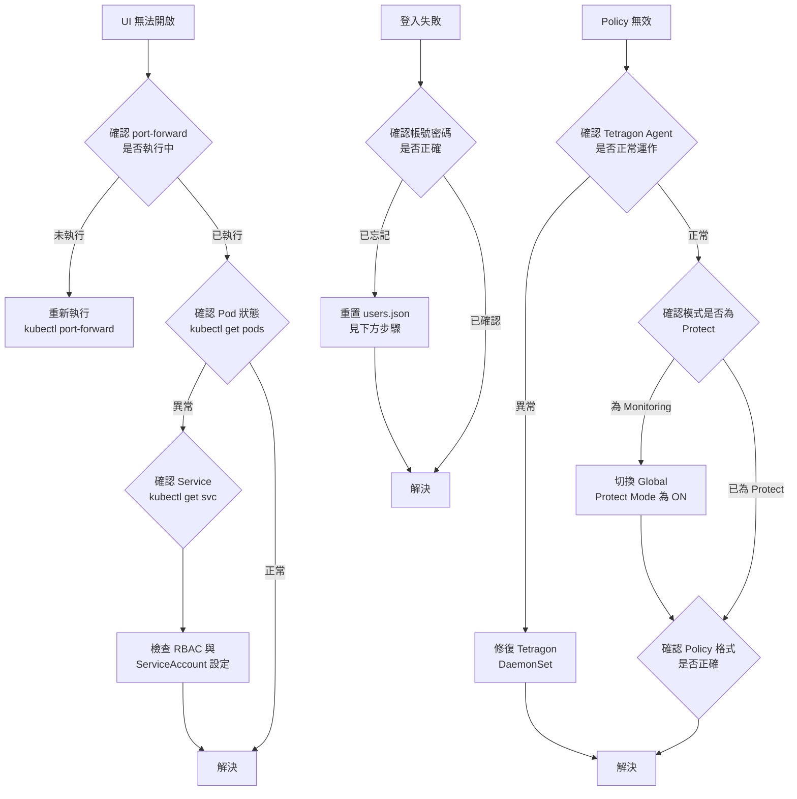

## 快速診斷流程



## 常見問題表格

| 問題症狀 | 可能原因 | 解決方式 |
|----------|----------|----------|
| UI 無法開啟（connection refused） | `port-forward` 未執行或已中斷 | 重新執行 `kubectl port-forward -n sentinel-system svc/sentinel-svc 8080:8080` |
| 登入失敗（帳號密碼錯誤） | 預設帳號已被修改或遺忘 | 重置 `users.json`（見下方步驟） |
| Policy 套用後無效 | 模式為 Monitoring（非 Protect） | 至 Global Settings 將 **Global Protect Mode** 切換為 ON |
| Behavior Discovery 無資料 | Tetragon Agent 未正常運作 | 確認 `tetragon` DaemonSet 狀態（見下方步驟） |
| Security Events 頁面空白 | TracingPolicy 尚未建立或 Tetragon 未偵測到事件 | 建立 TracingPolicy 並手動觸發對應事件後重新整理 |
| Pod 啟動失敗（CrashLoopBackOff） | ServiceAccount 無法連線叢集或 RBAC 設定錯誤 | 確認 ServiceAccount 與 ClusterRoleBinding 設定是否正確 |

## 重置管理員密碼

若忘記管理員密碼，可刪除 `users.json` 讓 Sentinel 重建預設帳號（`admin` / `admin`）：

```bash
# 找到 sentinel pod 名稱
kubectl get pods -n sentinel-system

# 刪除 users.json 讓系統在下次啟動時重建預設 admin/admin
kubectl exec -n sentinel-system <pod-name> -- rm /data/sentinel/users.json

# 刪除 pod，讓 Deployment 自動重啟並重建 users.json
kubectl delete pod -n sentinel-system <pod-name>
```

重啟完成後，即可使用預設帳號 `admin` / `admin` 登入，並立即修改密碼。

## 確認 Tetragon Agent 狀態

```bash
kubectl get pods -n kube-system -l app.kubernetes.io/name=tetragon
kubectl logs -n kube-system -l app.kubernetes.io/name=tetragon --tail=50
```

確認所有 tetragon Pod 均處於 `Running` 狀態，且 log 中無 `ERROR` 或 `FATAL` 訊息。若 DaemonSet Pod 數量不足（未覆蓋所有節點），請檢查節點 taints 與 tolerations 設定。

## 查看 Sentinel 日誌

```bash
# 查看最近 100 行日誌
kubectl logs -n sentinel-system deployment/sentinel --tail=100

# 即時追蹤日誌輸出
kubectl logs -n sentinel-system deployment/sentinel -f
```

日誌中可查看 API 請求記錄、JWT 驗證錯誤、TracingPolicy 操作結果等資訊，有助於快速定位問題根源。

:::tip
排查問題時，建議先執行以下指令確認 `sentinel-system` namespace 中所有資源的整體狀態：

```bash
kubectl get all -n sentinel-system
```

確認 Deployment、ReplicaSet、Pod、Service 均處於正常狀態後，再針對個別元件深入排查。
:::
