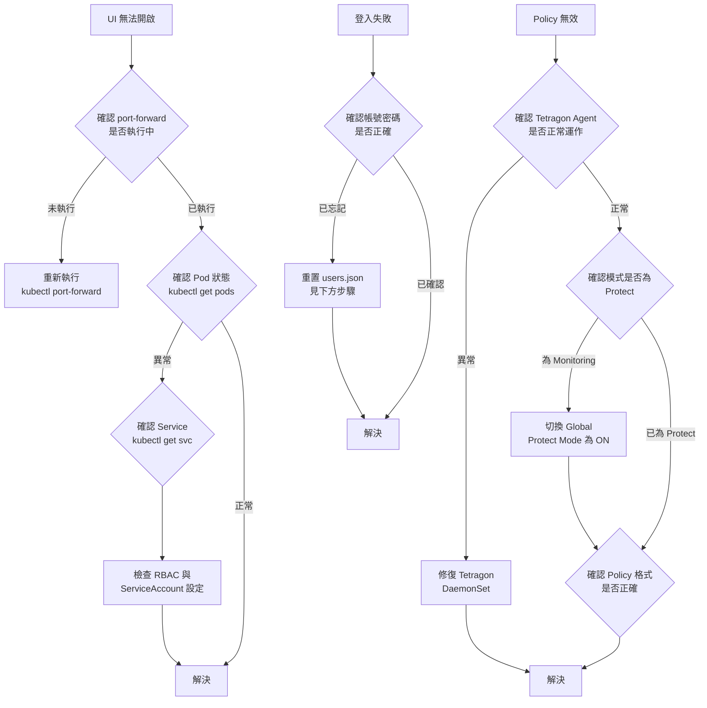

## 快速診斷流程


```mermaid
flowchart TD
    A[UI 無法開啟] --> B{確認 port-forward\n是否執行中}
    B -- 未執行 --> C[重新執行\nkubectl port-forward]
    B -- 已執行 --> D{確認 Pod 狀態\nkubectl get pods}
    D -- 異常 --> E{確認 Service\nkubectl get svc}
    E --> F[檢查 RBAC 與\nServiceAccount 設定]
    F --> Z1[解決]
    D -- 正常 --> Z1

    G[登入失敗] --> H{確認帳號密碼\n是否正確}
    H -- 已忘記 --> I[重置 users.json\n見下方步驟]
    I --> Z2[解決]
    H -- 已確認 --> Z2

    J[Policy 無效] --> K{確認 Tetragon Agent\n是否正常運作}
    K -- 異常 --> L[修復 Tetragon\nDaemonSet]
    K -- 正常 --> M{確認模式是否為\nProtect}
    M -- 為 Monitoring --> N[切換 Global\nProtect Mode 為 ON]
    N --> O{確認 Policy 格式\n是否正確}
    O --> Z3[解決]
    M -- 已為 Protect --> O
    L --> Z3
```

## 常見問題表格

| 問題症狀 | 可能原因 | 解決方式 |
|----------|----------|----------|
| UI 無法開啟（connection refused） | `port-forward` 未執行或已中斷 | 重新執行 `kubectl port-forward -n sentinel-system svc/sentinel 8080:80` |
| 登入失敗（帳號密碼錯誤） | 預設帳號已被修改或遺忘 | 重置 `users.json`（見下方步驟） |
| Policy 套用後無效 | 模式為 Monitoring（非 Protect） | 在 Tracing Policy 列表切換該 Policy 的 Mode，或以頁面頂部的 **Global Protect Mode** banner 全域切換為 ON |
| Behavior Discovery 無資料 | Tetragon Agent 未正常運作 | 確認 `tetragon` DaemonSet 狀態（見下方步驟） |
| Security Events 頁面空白 | TracingPolicy 尚未建立，或 Tetragon 事件串流中斷 | 先到「Cluster → Event Sources」確認各節點 Ingestion 為 `Connected`（`Stream Down` 時檢查 Tetragon gRPC 綁定與網路），再確認已建立 TracingPolicy |
| Pod 啟動失敗（CrashLoopBackOff） | ServiceAccount 無法連線叢集或 RBAC 設定錯誤 | 確認 ServiceAccount 與 ClusterRoleBinding 設定是否正確 |

## 重置管理員密碼

忘記管理員密碼時，依部署方式處理：

**未設定永久儲存（預設 `emptyDir`）**：帳號資料跟著 Pod 走，直接重啟即會重建預設帳號：

```bash
kubectl -n sentinel-system rollout restart deployment sentinel
```

**已掛載 PV / PVC**：需刪除儲存卷上的 `users.json` 再重啟。K8s Sentinel 容器是精簡的單一執行檔映像且以唯讀根檔案系統執行，不一定能以 `kubectl exec` 進入操作；最可靠的方式是建立一個臨時 Pod 掛載同一個 PVC 來刪檔：

```bash
kubectl -n sentinel-system run cleanup --rm -it --restart=Never --image=busybox   --overrides='{"spec":{"containers":[{"name":"cleanup","image":"busybox","command":["rm","/data/users.json"],"volumeMounts":[{"name":"data","mountPath":"/data"}]}],"volumes":[{"name":"data","persistentVolumeClaim":{"claimName":"sentinel-data"}}]}}'

kubectl -n sentinel-system rollout restart deployment sentinel
```

重啟完成後以預設帳號 `admin` / `admin` 登入，系統會依首次登入流程**強制要求設定新密碼**（見[登入 K8s Sentinel](./login.md)）。

## 確認 Tetragon Agent 狀態

```bash
kubectl get pods -n kube-system -l app.kubernetes.io/name=tetragon
kubectl logs -n kube-system -l app.kubernetes.io/name=tetragon --tail=50
```

確認所有 tetragon Pod 均處於 `Running` 狀態，且 log 中無 `ERROR` 或 `FATAL` 訊息。若 DaemonSet Pod 數量不足（未覆蓋所有節點），請檢查節點 taints 與 tolerations 設定。

## 查看 K8s Sentinel 日誌

```bash
# 查看最近 100 行日誌
kubectl logs -n sentinel-system deployment/sentinel --tail=100

# 即時追蹤日誌輸出
kubectl logs -n sentinel-system deployment/sentinel -f
```

日誌中可查看 API 請求記錄、JWT 驗證錯誤、TracingPolicy 操作結果等資訊，有助於快速定位問題根源。

:::tip
排查問題時，建議先執行以下指令確認 `sentinel-system` namespace 中所有資源的整體狀態：

```bash
kubectl get all -n sentinel-system
```

確認 Deployment、ReplicaSet、Pod、Service 均處於正常狀態後，再針對個別元件深入排查。
:::
