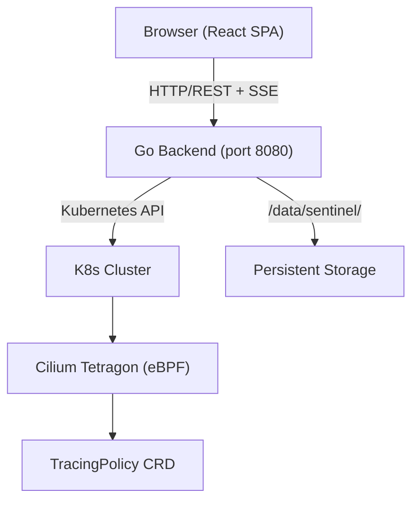
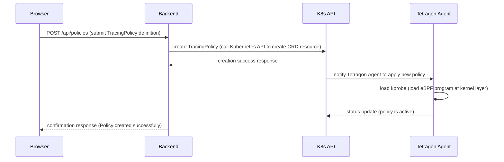

# Architecture

## System Architecture Diagram

The diagram below illustrates the deployment relationships and communication paths between Sentinel components:

## Component Overview

| Component | Technology | Description |
|---|---|---|
| Frontend | TypeScript + React + Vite + shadcn/ui | Web UI delivered as an SPA, providing TracingPolicy management, event viewing, and cluster monitoring |
| Backend | Go 1.x + HTTP Server (port 8080) | RESTful API service with a built-in Kubernetes client, handling cluster communication and user authentication |
| Cilium Tetragon | eBPF DaemonSet | Security observation agent deployed on every Kubernetes node, capturing syscalls and network events at the kernel layer via eBPF |
| TracingPolicy | Kubernetes CRD (cilium.io/v1alpha1) | Custom Resource Definition that defines the kprobe rules and security policies Tetragon should enforce |
| Persistent Storage | /data/sentinel/ | Local persistence path for user accounts (`users.json`) and JWT signing key (`.jwt-secret`) |

## Data Flow

The sequence diagram below shows the complete flow when a user creates a new TracingPolicy through Sentinel:

## Deployment Architecture

Sentinel uses a **single binary deployment** model that greatly simplifies the installation process.

The Go backend embeds the frontend React SPA's static files (HTML, JavaScript, CSS) at compile time using `embed.go`. Deployment requires only copying and running a single executable — no additional web server or static file service needed.

Persistent data is stored at the following paths:

| Path | Purpose |
|---|---|
| `/data/sentinel/users.json` | Stores user accounts and password hashes |
| `/data/sentinel/.jwt-secret` | Stores the JWT Token signing key, auto-generated on first startup |
