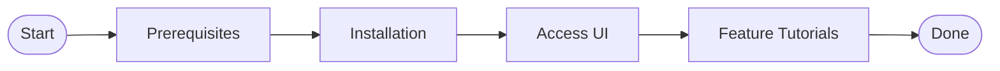

# Project Overview

## What is Sentinel

Sentinel is a graphical management console for Cilium Tetragon TracingPolicy within Kubernetes clusters. It enables DevSecOps engineers and Platform teams to manage the full lifecycle of security monitoring policies through an intuitive web interface — eliminating tedious manual `kubectl` operations and dramatically lowering the barrier to policy deployment and maintenance.

## Core Features

| Module | Description |
|---|---|
| TracingPolicy Management | Visually create, edit, enable, disable, and delete TracingPolicies — no manual YAML required |
| Admission Policy | Graphically build Kubernetes ValidatingAdmissionPolicies with seven rule types: Label, Image, resource limits, and more |
| Network Topology | Interactive graph of Pod TCP connections in the cluster — quickly identify anomalous network traffic |
| Behavior Discovery | Automatically analyze workload behavior in the cluster to help engineers discover security baselines |
| Security Events | Real-time display of kprobe security events captured by Tetragon, with filtering and tracking support |
| Admission Events | Record ValidatingAdmissionPolicy violation events received via the Kubernetes Audit Webhook |
| Alerts | Configure webhook alert rules to push security events to Slack / Teams / Discord |
| Syslog | Forward security events to an external syslog server via UDP or TCP |
| Cluster Info | Overview of Kubernetes cluster nodes, namespaces, and Tetragon Agent status |
| User Management | User account creation, role assignment, and JWT authentication management |
| Event Retention | Configure max event counts and TTL to control database storage usage |

## Target Audience

- **DevSecOps Engineers**: Personnel who need to rapidly define and adjust eBPF security policies in Kubernetes environments and continuously monitor security events
- **Platform Teams**: Engineers responsible for operating Kubernetes clusters, managing Cilium network policies, and ensuring Tetragon security observability is functioning correctly
- **Teams adopting Tetragon in K8s**: Technical staff who want to deploy Tetragon TracingPolicy in production but are unfamiliar with CRD operations or want to improve policy management efficiency

## Reading Guide

We recommend reading this documentation in the following order for the fastest path to deploying and using Sentinel:

