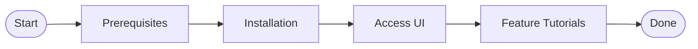

# Project Overview

## What is K8s Sentinel

K8s Sentinel is a Kubernetes security management platform built on **Cilium and Tetragon (eBPF)**, bringing the capabilities a cluster's security posture needs into one graphical console:

- **Runtime security**: monitor and block process executions and file access with TracingPolicy (Monitoring / Protect modes)
- **Network security**: manage Pod Ingress / Egress access with Cilium Network Policy, with Network Topology showing actual traffic and the external exposure surface
- **Admission control**: intercept non-compliant configuration at creation time with ValidatingAdmissionPolicy
- **Incident response**: a live security event stream, one-click Pod network isolation (Quarantine), webhook alerts and Syslog forwarding
- **Auditability**: every operation and sign-in recorded in the Audit Log

DevSecOps engineers and Platform teams manage the full lifecycle of security policies and see the cluster's security state in real time, without hand-writing YAML or driving everything through `kubectl`, dramatically lowering the barrier to operating Kubernetes security.

## Core Features

| Module | Description |
|---|---|
| TracingPolicy Management | Visually create, edit, enable, disable, and delete TracingPolicies - no manual YAML required |
| Admission Policy | Graphically build Kubernetes ValidatingAdmissionPolicies with seven rule types: Label, Image, resource limits, and more |
| Network Policy | Graphically build Cilium Network Policies to manage Pod Ingress / Egress access rules, including L7 HTTP rules |
| Quarantine | One-click network isolation of a suspicious Pod for incident response - the process and memory stay intact for forensics |
| Network Topology | Interactive graph of Pod connections observed by Cilium (including L7) - quickly identify anomalous network traffic |
| Behavior Discovery | Automatically analyze workload behavior in the cluster to help engineers discover security baselines |
| Security Events | Real-time display of kprobe security events captured by Tetragon, with filtering and tracking support |
| Admission Events | Record ValidatingAdmissionPolicy violation events received via the Kubernetes Audit Webhook |
| Alerts | Configure webhook alert rules to push security events to Slack / Teams / Discord |
| Syslog | Forward security events to an external syslog server via UDP or TCP |
| Event Sources | Live health of the Tetragon per-node streams and Hubble Relay, so "monitoring" never silently means "blind" |
| User Management | User account creation, role assignment, and JWT authentication management, with forced first-login password change and login rate limiting |
| Audit Log | A record of every operation performed through K8s Sentinel (who, when, target, outcome), filterable and exportable to CSV |
| Event Retention | Configure max event counts and TTL to control database storage usage |

## Target Audience

- **DevSecOps Engineers**: Personnel who need to rapidly define and adjust eBPF security policies in Kubernetes environments and continuously monitor security events
- **Platform Teams**: Engineers responsible for operating Kubernetes clusters, managing Cilium network policies, and ensuring Tetragon security observability is functioning correctly
- **Teams adopting Tetragon in K8s**: Technical staff who want to deploy Tetragon TracingPolicy in production but are unfamiliar with CRD operations or want to improve policy management efficiency

## Reading Guide

We recommend reading this documentation in the following order for the fastest path to deploying and using K8s Sentinel:

```mermaid
flowchart LR
    A([Start]) --> B[Prerequisites]
    B --> C[Installation]
    C --> D[Access UI]
    D --> E[Feature Tutorials]
    E --> F([Done])
```
