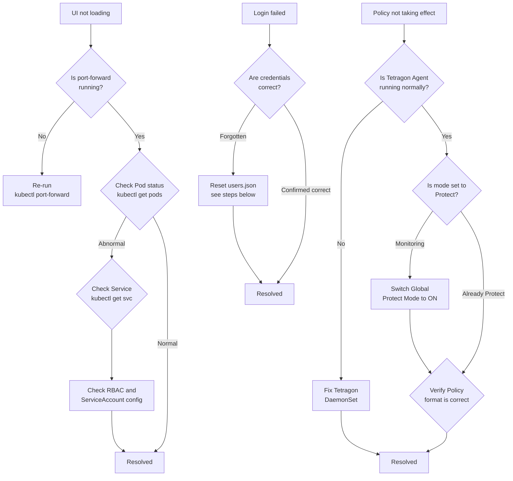

## Quick Diagnosis Flow



## Common Issues

| Symptom | Possible Cause | Solution |
|----------|----------|----------|
| UI not loading (connection refused) | `port-forward` not running or interrupted | Re-run `kubectl port-forward -n sentinel-system svc/sentinel-svc 8080:8080` |
| Login failed (wrong credentials) | Default account has been changed or forgotten | Reset `users.json` (see steps below) |
| Policy has no effect after applying | Mode is Monitoring (not Protect) | Go to Global Settings and set **Global Protect Mode** to ON |
| No data in Behavior Discovery | Tetragon Agent not running normally | Check `tetragon` DaemonSet status (see steps below) |
| Security Events page is empty | No TracingPolicy created or Tetragon has not detected events | Create a TracingPolicy and manually trigger the corresponding event, then refresh |
| Pod startup failed (CrashLoopBackOff) | ServiceAccount cannot connect to cluster or RBAC misconfiguration | Verify ServiceAccount and ClusterRoleBinding are configured correctly |

## Reset Admin Password

If the admin password has been forgotten, delete `users.json` to let Sentinel recreate the default account (`admin` / `admin`):

```bash
# Find the sentinel pod name
kubectl get pods -n sentinel-system

# Delete users.json so the system rebuilds it with defaults on next startup
kubectl exec -n sentinel-system <pod-name> -- rm /data/sentinel/users.json

# Delete the pod so the Deployment restarts and rebuilds users.json
kubectl delete pod -n sentinel-system <pod-name>
```

After restart, log in with the default credentials `admin` / `admin` and change the password immediately.

## Check Tetragon Agent Status

```bash
kubectl get pods -n kube-system -l app.kubernetes.io/name=tetragon
kubectl logs -n kube-system -l app.kubernetes.io/name=tetragon --tail=50
```

Confirm all Tetragon Pods are in `Running` state and there are no `ERROR` or `FATAL` messages in the logs. If the DaemonSet Pod count is insufficient (not covering all nodes), check node taints and tolerations.

## View Sentinel Logs

```bash
# View the last 100 lines of logs
kubectl logs -n sentinel-system deployment/sentinel --tail=100

# Follow logs in real time
kubectl logs -n sentinel-system deployment/sentinel -f
```

Logs contain API request records, JWT authentication errors, TracingPolicy operation results, and other information helpful for quickly pinpointing issues.

:::tip
When troubleshooting, first run the following command to check the overall status of all resources in the `sentinel-system` namespace:

```bash
kubectl get all -n sentinel-system
```

After confirming that the Deployment, ReplicaSet, Pod, and Service are all in a normal state, drill down into individual components as needed.
:::
