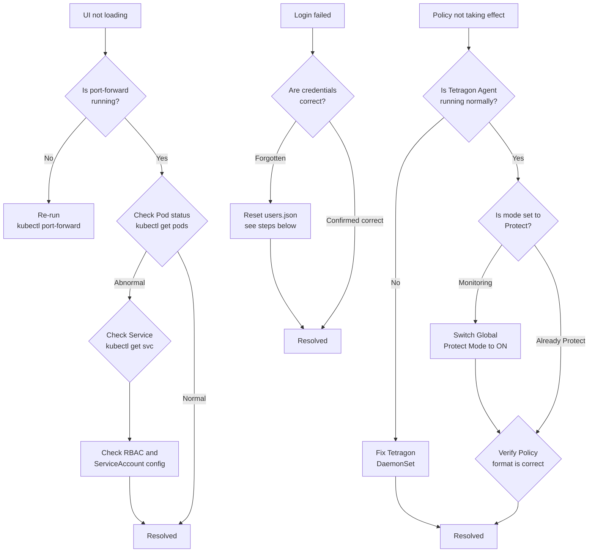

## Quick Diagnosis Flow


```mermaid
flowchart TD
    A[UI not loading] --> B{Is port-forward\nrunning?}
    B -- No --> C[Re-run\nkubectl port-forward]
    B -- Yes --> D{Check Pod status\nkubectl get pods}
    D -- Abnormal --> E{Check Service\nkubectl get svc}
    E --> F[Check RBAC and\nServiceAccount config]
    F --> Z1[Resolved]
    D -- Normal --> Z1

    G[Login failed] --> H{Are credentials\ncorrect?}
    H -- Forgotten --> I[Reset users.json\nsee steps below]
    I --> Z2[Resolved]
    H -- Confirmed correct --> Z2

    J[Policy not taking effect] --> K{Is Tetragon Agent\nrunning normally?}
    K -- No --> L[Fix Tetragon\nDaemonSet]
    K -- Yes --> M{Is mode set to\nProtect?}
    M -- Monitoring --> N[Switch Global\nProtect Mode to ON]
    N --> O{Verify Policy\nformat is correct}
    O --> Z3[Resolved]
    M -- Already Protect --> O
    L --> Z3
```

## Common Issues

| Symptom | Possible Cause | Solution |
|----------|----------|----------|
| UI not loading (connection refused) | `port-forward` not running or interrupted | Re-run `kubectl port-forward -n sentinel-system svc/sentinel 8080:80` |
| Login failed (wrong credentials) | Default account has been changed or forgotten | Reset `users.json` (see steps below) |
| Policy has no effect after applying | Mode is Monitoring (not Protect) | Switch the policy Mode on the Tracing Policy list, or flip the **Global Protect Mode** banner at the top of that page to ON |
| No data in Behavior Discovery | Tetragon Agent not running normally | Check `tetragon` DaemonSet status (see steps below) |
| Security Events page is empty | No TracingPolicy created, or a Tetragon event stream is down | Check "Cluster → Event Sources" first: every node should show Ingestion `Connected` (on `Stream Down`, check the Tetragon gRPC bind and network), then confirm a TracingPolicy exists |
| Pod startup failed (CrashLoopBackOff) | ServiceAccount cannot connect to cluster or RBAC misconfiguration | Verify ServiceAccount and ClusterRoleBinding are configured correctly |

## Reset Admin Password

If the admin password is forgotten, the fix depends on how storage is deployed:

**Without persistent storage (the default `emptyDir`)**: account data lives and dies with the Pod, so a restart recreates the default account:

```bash
kubectl -n sentinel-system rollout restart deployment sentinel
```

**With a PV / PVC mounted**: delete `users.json` from the volume, then restart. The K8s Sentinel container is a minimal single-binary image running with a read-only root filesystem, so `kubectl exec` may not be available; the reliable way is a temporary Pod mounting the same PVC to remove the file:

```bash
kubectl -n sentinel-system run cleanup --rm -it --restart=Never --image=busybox \
  --overrides='{"spec":{"containers":[{"name":"cleanup","image":"busybox","command":["rm","/data/users.json"],"volumeMounts":[{"name":"data","mountPath":"/data"}]}],"volumes":[{"name":"data","persistentVolumeClaim":{"claimName":"sentinel-data"}}]}}'

kubectl -n sentinel-system rollout restart deployment sentinel
```

After the restart, sign in with the default `admin` / `admin`; the first-login flow will **force you to set a new password** (see [Sign In to K8s Sentinel](./login.md)).

## Check Tetragon Agent Status

```bash
kubectl get pods -n kube-system -l app.kubernetes.io/name=tetragon
kubectl logs -n kube-system -l app.kubernetes.io/name=tetragon --tail=50
```

Confirm all Tetragon Pods are in `Running` state and there are no `ERROR` or `FATAL` messages in the logs. If the DaemonSet Pod count is insufficient (not covering all nodes), check node taints and tolerations.

## View K8s Sentinel Logs

```bash
# View the last 100 lines of logs
kubectl logs -n sentinel-system deployment/sentinel --tail=100

# Follow logs in real time
kubectl logs -n sentinel-system deployment/sentinel -f
```

Logs contain API request records, JWT authentication errors, TracingPolicy operation results, and other information helpful for quickly pinpointing issues.

:::tip
When troubleshooting, first run the following command to check the overall status of all resources in the `sentinel-system` namespace:

```bash
kubectl get all -n sentinel-system
```

After confirming that the Deployment, ReplicaSet, Pod, and Service are all in a normal state, drill down into individual components as needed.
:::
